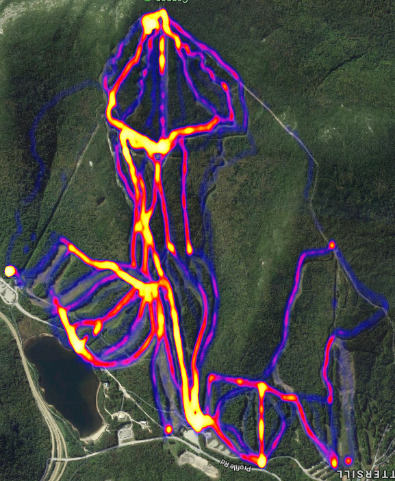

# ski heat map
Generate heat maps from your skiing data.

## Usage
The Ski Tracks app exports data to the gpx format. Export the data you want and put all the files in a `tracks/` folder in this repositories root. Make sure you have node.js installed (this was made for Node v8.12.0).

Run the command:
```sh
node ./index.js
```

Wait a bit, and it will generate the map. Some settings are exposed in the `index.js` file.

You can do some work to overlay your heatmap on a google earth image. Screenshot google earth and use an image editor to scale your image to fit over the map.

## Example
Here is an example heatmap, overlayed onto Cannon Mountain.

